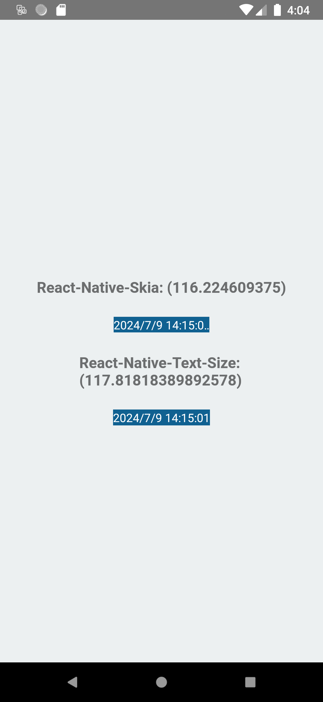

react-native-skia has inaccurate text size calculation.

As you can see, it could not correctly calculate the text width, so in render time
the real width is bigger than the calculated one and causes ellipse on the text.

you can also clone and try different text stings.
